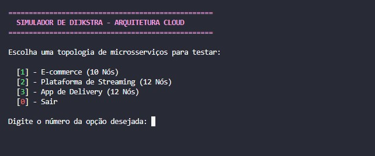
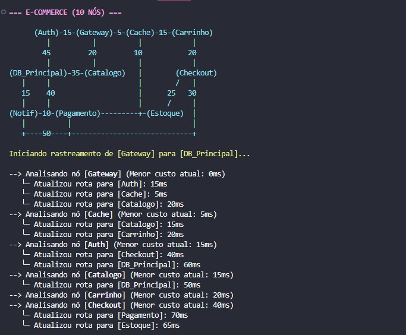
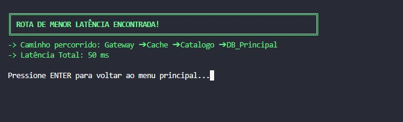

## Alunos
|Matrícula | Aluno |
| -- | -- |
| 202016266  |  Gabriel Marques de Souza |
| 222008468  |  Danilo Sarmento Barros |

## Apresentação

[Clique aqui para assistir ao vídeo](https://drive.google.com/file/d/1aXaCfXMwMoMKOYXzkxJaQ2RjHWxswPJs/view?usp=sharing)

# Otimização de Roteamento em Microsserviços (Algoritmo de Dijkstra)

Este projeto aplica a teoria de grafos para resolver um problema real de engenharia de software: a redução de latência e otimização de tráfego em arquiteturas de microsserviços distribuídas.

## Contexto do Problema
Em sistemas modernos, uma única ação do utilizador pode desencadear uma cascata de chamadas entre dezenas de serviços. Cada ligação possui uma latência variável (peso da aresta) influenciada por fatores como carga de rede, distância física ou processamento.

O objetivo desta aplicação é encontrar o **caminho de menor custo (menor latência)** para garantir que a informação flua do ponto de entrada (*Gateway*) até ao destino final da forma mais eficiente possível.

## Screenshots







## 🛠️ Como Executar

### Pré-requisitos
* [Node.js](https://nodejs.org/) instalado.

### Passo a Passo
1.  Clona este repositório para a tua máquina local.
2.  Navega até à pasta do projeto através do terminal.
3.  Executa o ficheiro interativo:

    ```bash
    node djikstra.js
    ```
